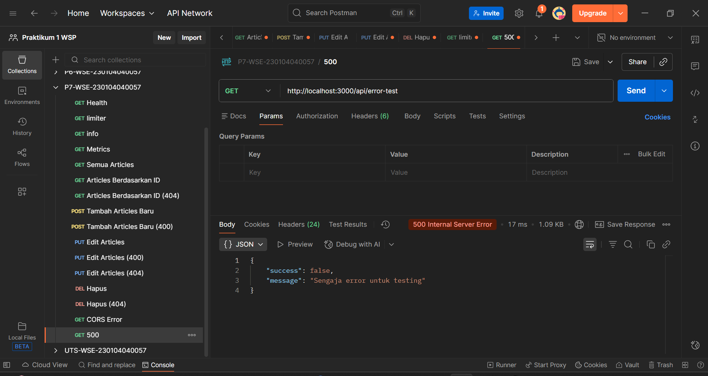
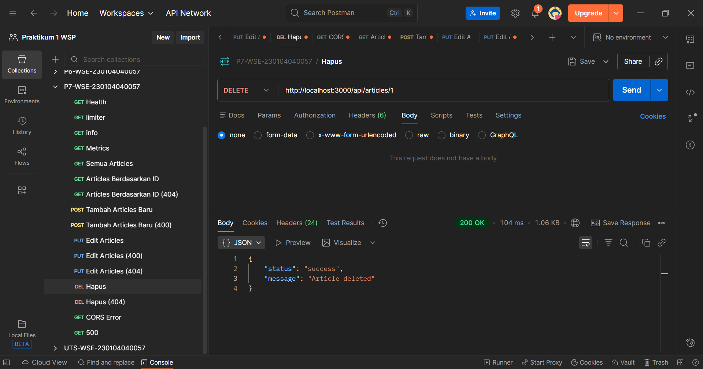

# Praktikum 7 --- RESTful API Hardening & Observability

### Mata Kuliah: **Web Service Engineering (20251)**

### Nama: **Muhammad Fahrul Bahri**

### NIM: **230104040057**

------------------------------------------------------------------------

## 1. Deskripsi Praktikum

Praktikum ini berfokus pada peningkatan keamanan (**API Hardening**) dan
pemantauan sistem (**Observability**) pada API hasil UTS sebelumnya.\
Tujuan dari praktikum ini adalah memastikan API menjadi lebih aman,
stabil, dan mudah dipantau saat berjalan.

Fitur yang diimplementasikan:

-   Security Middleware: **Helmet**, **CORS**, **Rate Limiting**
-   Environment Variable menggunakan **dotenv**
-   Logging request menggunakan **Morgan**
-   Global & Consistent **Error Handler**
-   Endpoint Monitoring: **/api/health** dan **/metrics**

------------------------------------------------------------------------

## 2. Learning Outcomes (LO)

1.  Menerapkan middleware keamanan dasar (Helmet, CORS, Rate Limit).\
2.  Menggunakan environment variable (.env) untuk konfigurasi project.\
3.  Menerapkan logging request menggunakan Morgan.\
4.  Membuat Global Error Handler yang konsisten dan reusable.\
5.  Membuat endpoint monitoring API (/api/health).\
6.  Memahami prinsip observability dalam Web Service Engineering.

------------------------------------------------------------------------

## 3. Prasyarat

Mahasiswa harus telah menyelesaikan:

-   Praktikum 5 --- Dasar Express\
-   Praktikum 6 --- Modularization & Routing\
-   UTS --- CRUD RESTful API

------------------------------------------------------------------------

## 4. Setup Project

### 1️⃣ Buat folder baru:

    P7-Hardening-230104040057/

### 2️⃣ Pindahkan seluruh project UTS ke dalam folder tersebut.

### 3️⃣ Install dependency:

``` bash
npm install helmet cors express-rate-limit dotenv morgan
```

### 4️⃣ Buat file `.env`:

    PORT=3000
    RATE_LIMIT=100
    NODE_ENV=development
    ALLOWED_ORIGIN=*

### 5️⃣ Buat file `.env.example`

    PORT=
    RATE_LIMIT=
    NODE_ENV=
    ALLOWED_ORIGIN=

------------------------------------------------------------------------

## 5. Implementasi Security & Observability

### 🛡 A. Security Middleware

``` js
const helmet = require('helmet');
const cors = require('cors');
const rateLimit = require('express-rate-limit');

app.use(helmet());
app.use(cors({ origin: process.env.ALLOWED_ORIGIN }));
```

#### Rate Limiter

``` js
const limiter = rateLimit({
  windowMs: 15 * 60 * 1000,
  max: process.env.RATE_LIMIT,
  message: { status: "fail", message: "Terlalu banyak request." }
});
app.use(limiter);
```

------------------------------------------------------------------------

### 📄 B. Logging (Morgan)

``` js
const morgan = require("morgan");
app.use(morgan("combined"));
```

------------------------------------------------------------------------

### ❗ C. Global Error Handler

File: `src/middlewares/errorHandler.js`

``` js
module.exports = (err, req, res, next) => {
  console.error(err.stack);
  res.status(err.status || 500).json({
    status: "error",
    message: err.message || "Internal Server Error",
  });
};
```

Tambahkan ke `app.js`:

``` js
const errorHandler = require('./middlewares/errorHandler');
app.use(errorHandler);
```

------------------------------------------------------------------------

### ❤️ D. Health Check Endpoint

``` js
app.get('/api/health', (req, res) => {
  res.status(200).json({
    status: "ok",
    environment: process.env.NODE_ENV,
    timestamp: new Date().toISOString()
  });
});
```

------------------------------------------------------------------------

## 6. Struktur Folder

    src/
     ├── app.js
     ├── controllers/
     ├── routes/
     ├── middlewares/
     ├── utils/
     ├── data/
     ├── logs/
     ├── .env
     └── .env.example

------------------------------------------------------------------------

## 7. Uji API

  Fitur           Cara Uji
  --------------- -------------------------------
  Health Check    GET `/api/health`
  Rate Limiter    Spam request dengan cepat
  Logging         Cek `logs/access.log`
  Error Handler   Akses endpoint yang tidak ada
  CRUD Resource   Test menggunakan Postman
  CORS            Test fetch dari browser

------------------------------------------------------------------------

## 8. Output Praktikum

Mahasiswa wajib mengumpulkan:

-   Folder project lengkap\
-   `.env` dan `.env.example`\
-   Screenshot pengujian API (disimpan di `/evidence/P7/`)\
-   Laporan `README_P7.md`

------------------------------------------------------------------------

## 9. Rubrik Penilaian

  Komponen                     Bobot
  ---------------------------- -------
  Helmet, CORS, Rate Limiter   25%
  Logging                      20%
  Error Handler                20%
  Health Endpoint              15%
  Dokumentasi                  10%
  Kerapian Kode                10%

------------------------------------------------------------------------

## 10. Catatan

-   Resource CRUD mengikuti project UTS.\
-   Semua konfigurasi menggunakan environment variable.\
-   Log wajib tersimpan dalam file.\
-   Struktur project harus modular dan rapi.

------------------------------------------------------------------------

## 11. Screenshot

| 500 Error | CORS Error | Delete Error |
| :---: | :---: | :---: |
|  |  |  |

---

| Delete | GET All | GET By Id Error |
| :---: | :---: | :---: |
|  |  |  |

---

| GET By Id | GET Health | GET Info |
| :---: | :---: | :---: |
|  |  |  |

---

| GET Limiter | GET Metrics | POST Create Error |
| :---: | :---: | :---: |
|  |  |  |

---

| POST Create | PUT Edit Error 400 | PUT Edit Error 404 |
| :---: | :---: | :---: |
|  |  |  |

---

| PUT Edit |
| :---: |
|  |
